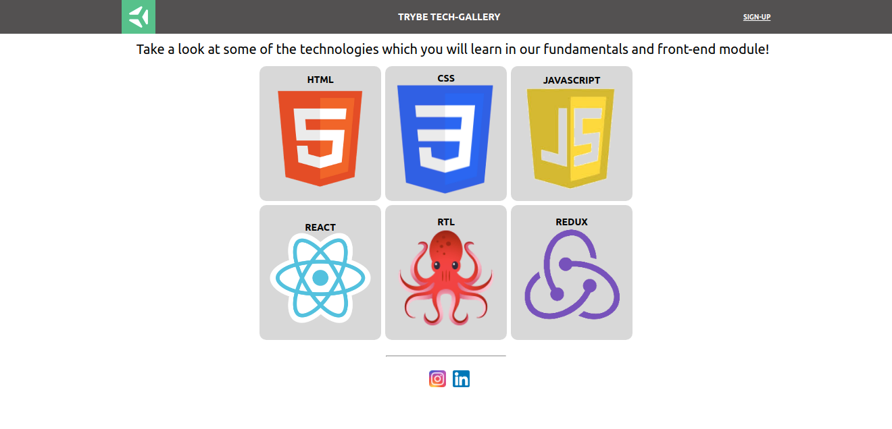

## Dia 6.3

### Exercícios

Os exercícios do dia de hoje foram feitos através de um repositório privado disponibilizado pela [Trybe] (https://www.betrybe.com/);

Aqui está a imagem do resultado final:

- As instruções para a relização estam no README.
- Foi utilizado o FlexBox na resolução dos exercícios (Conteúdo passado no dia de hoje);
- Algumas propriedades usadas foram:
    - `justify-content`
    - `align-items`
    - `flex-wrap`

A proposta do exercício era:
    - Crie um cabeçalho para sua aplicação utilizando a tag header. Este cabeçalho deve possuir 3 elementos e estes devem ser posicionados utilizando Flexbox. O resultado deverá ser similar à estrutura da página "Trybe Tech-Gallery"

    - Implemente o conteúdo da primeira section. Esta seção deverá conter no mínimo um elemento de texto.

    - Implemente o posicionamento da segunda section. Esta seção deverá conter no mínimo 6 imagens e um título para cada uma delas. Sinta-se livre para usar a imaginação e selecionar as imagens que preferir, só não esqueça de seguir a estrutura de posicionamento proposta. 

    -Por fim, faça o posicionamento do footer/rodapé, este é o ultimo elemento necessário para que nossa aplicação fique completa. O rodapé deverá conter no mínimo 2 elementos. Para o exemplo, foram adicionadas imagens que redirecionam o usuário para as redes sociais da Trybe.
