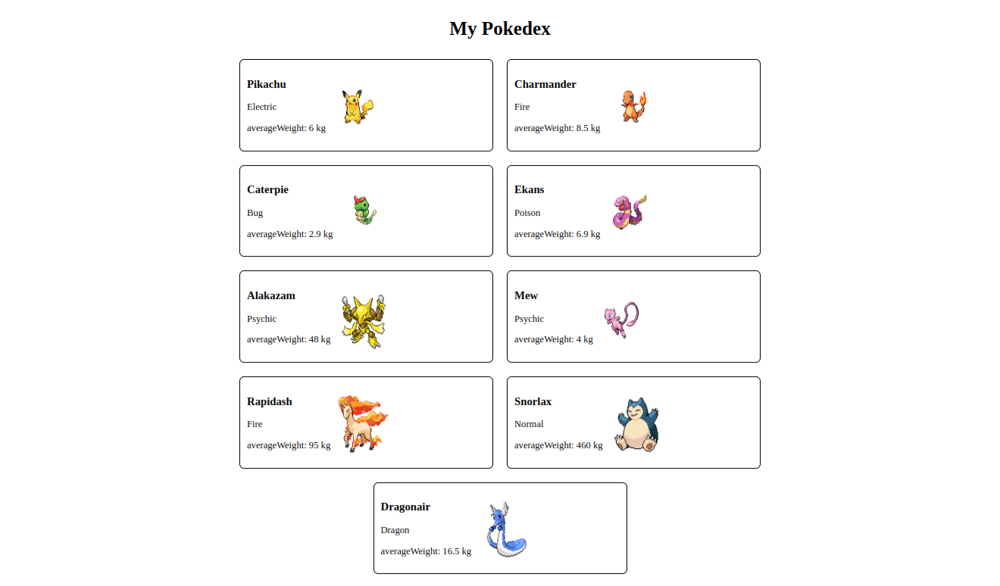

## Dia 10.2 - Componentes React

Neste dia aprendi sobre:

- *Criar componentes React corretamente;*

- *Fazer uso de props corretamente;*

- *Fazer composição de componentes corretamente;*

- *Criar múltiplos componentes dinamicamente.*

- *Utilizar PropTypes para checar o tipo de uma prop no uso de um componente;*

- *Utilizar PropTypes para garantir a presença de props obrigatórias no uso de um componente;*

- *Utilizar PropTypes para checar que uma prop é um objeto de formato específico;*

- *Utilizar PropTypes para garantir que uma prop é um array com elementos de um determinado tipo;*

Ao final do dia realizei um exercício para colocar em pŕatica tudo o que foi aprendido, o resultado está na imagem abaixo: 

