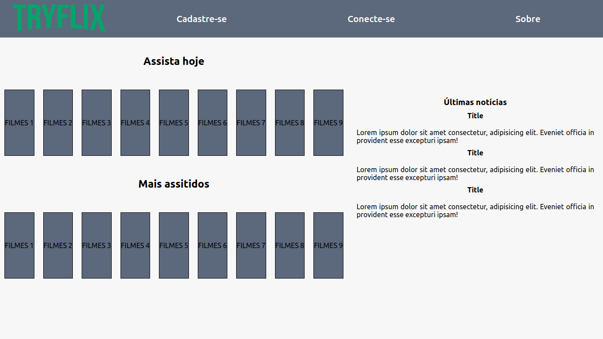

## Dia 6.4

### Exercícios - Parte 1

1 - Adicione uma propriedade que defina o tamanho Flexbox base para o container da imagem 268px e para o container do menu 500px. Após aplicar as propriedades o header deverá estar similar a imagem abaixo:

2 - Adicione uma propriedade Flexbox que modifique a ordem em que a logomarca e os itens do menu aparecem na tela. Após aplicar a propriedade o header deverá estar similar a imagem abaixo:

3 - Adicione uma propriedade Flexbox que faça o container do menu crescer, quando houver espaço disponível. Após aplicar a propriedade o header deverá estar similar a imagem abaixo:

4 - Utilize a propriedade align-self no elemento correto para que o header da página tenha o seguinte comportamento:

### Exercícios - Parte 2

1 - Aplique uma base de 350px para seu container aside . Deverá ficar similar a imagem abaixo:

2 - Aplique um alinhamento para centralizar e outro para expandir. Seu aside apresentar o seguinte comportamento:

3 - Adicione uma propriedade que faça com que seu container de filmes tenha uma base de 700px e outra base de 16% para as div do container de seu card. Deve ficar similar a imagem abaixo:

4 - Aplique uma propriedade com o valor 10 que expanda o container de filmes. Deve ficar similar a imagem abaixo:

5 - Adicione uma propriedade com o valor 1 que faça com que suas div do container de filmes ocupe todo o espaço em branco. Deve ficar similar a imagem abaixo:
